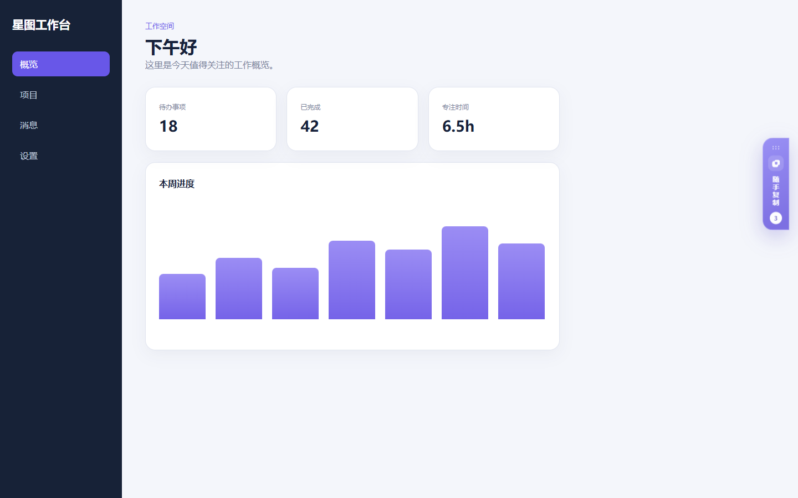

# 随手复制

一个本地优先的 Chrome / Edge 浏览器扩展。点击工具栏图标可在中文弹窗中开启或关闭插件；开启后，它在网页中提供可拖动、可收起的悬浮面板，使用“模板 → 一级分类 → 二级文字内容”整理常用信息。一级分类可连同全部下级内容复制到其他模板，进入分类后单击文字卡片即可复制完整正文。

| 模板与一级分类 | 跨模板整组粘贴 | 二级内容详情 | 可拖动收起标签 |
| --- | --- | --- | --- |
|  |  |  |  |

### 工具栏控制弹窗


## 功能

- 可自行命名并新建、选择、编辑或删除模板
- 每个模板分别保存自己的一级分类和二级文字内容
- 旧版已有分类与内容自动归入“默认模板”，原 ID、顺序、正文和时间不变
- 每个一级分类提供“复制整组”，同时暂存分类名称、说明及全部二级内容
- 切换到其他模板后点击“粘贴整组”，生成一套 ID 独立的副本，不影响来源记录
- 整组复制暂存保存在本机，可跨网页标签使用，也可手动清除
- 一级首页只展示分类，点击分类后进入二级内容
- 点击浏览器工具栏图标打开中文控制弹窗
- 通过总开关显示或完全隐藏所有网页中的悬浮面板
- 可从弹窗一键在当前网页打开并展开面板
- 关闭插件只改变显示状态，不会删除分类和文字记录
- 拖动紫色标题栏或六点手柄，可在可视区域内移动整个展开面板
- 收起后拖动紫色标签，可沿浏览器右侧调整上下位置
- 窗口位置自动保存，刷新后保持；窗口缩小时会自动限制在屏幕内
- 一级分类和二级文字卡片都可通过六点手柄拖动排序
- 支持 `Alt + ↑/↓` 键盘移动，排序结果刷新后仍会保留
- 分类显示名称、说明、内容数量和二级标题预览
- 在分类内新增、编辑、删除可复制文字卡片
- 单击二级卡片复制完整文本，保留换行与首尾空格
- 首页搜索会同时匹配分类名称、说明及其二级正文
- 分类内搜索只筛选当前分类的文字内容
- 删除非空分类前二次确认，并明确提示关联内容数量
- 删除模板前明确提示其中的分类数与内容数，且始终至少保留一个模板
- 从 1.0 升级时，原有平铺内容自动归入“未分类”
- 一键收起或展开，并记住上次状态
- 数据通过 `chrome.storage.local` 保存在本机
- 工具栏图标打开控制弹窗，`Alt + Shift + C` 快捷键切换面板
- Shadow DOM 样式隔离、深色模式和窄屏适配

## 本地安装

### Chrome

1. 打开 `chrome://extensions/`。
2. 开启右上角的“开发者模式”。
3. 点击“加载已解压的扩展程序”。
4. 选择本项目根目录（即包含 `manifest.json` 的文件夹）。

### Edge

1. 打开 `edge://extensions/`。
2. 开启“开发人员模式”。
3. 点击“加载解压缩的扩展”。
4. 选择本项目根目录。

安装后打开任意普通网页即可看到右侧面板；点击浏览器工具栏中的“随手复制”图标可打开控制弹窗。浏览器内部页面（例如 `chrome://`、`edge://` 和扩展商店）出于浏览器安全规则不能注入面板，弹窗会对此给出说明。

## 使用方式

1. 点击工具栏图标，通过顶部总开关开启或关闭悬浮面板；需要时可点击“在当前网页打开并展开”。
2. 按住紫色标题栏或标题栏六点手柄拖动，可调整展开窗口的位置；按 `Alt + 方向键` 可键盘微调。
3. 点击面板右上角箭头收起；收起标签可上下拖动，单击标签仍会正常展开。
4. 在顶部选择现有模板，或点击 `+` 自行命名并建立模板；铅笔按钮可修改或删除当前模板。
5. 在模板首页点击“分类”，填写一级分类名称及可选说明。
6. 保存后自动进入该分类，再点击“内容”添加二级文字。
7. 单击二级卡片主体复制完整正文；编辑、删除按钮不会触发复制。
8. 需要复用整组内容时，在一级卡片上点击“复制整组”，切换目标模板，再点击绿色暂存栏中的“粘贴整组”。
9. 按住卡片左下角的六点手柄拖动，即可调整当前模板内的卡片顺序；搜索时需先清空关键词。
10. 聚焦卡片拖动手柄后，也可以按 `Alt + ↑/↓` 移动卡片。
11. 点击左上角返回箭头回到当前模板的全部分类。

## 升级说明

数据模型会自动兼容旧版本：1.0 的平铺内容会先迁入“未分类”，1.1 的两级数据会按升级前的显示顺序生成排序编号；升级到 1.5 后，所有既有分类和内容再整体归入“默认模板”。1.3 的启停开关、1.4 的窗口位置和 1.5 的整组复制暂存均使用独立设置。迁移会保留原 ID、正文格式、层级关系、排序、创建时间和更新时间。

## 隐私与权限

- `storage`：仅用于在浏览器本地保存模板、分类、文字卡片、整组复制暂存、排序、收起状态、启停开关和窗口位置。
- 网页访问范围：用于在普通网页中注入右侧悬浮面板。
- 扩展不包含分析代码、远程接口或网络上传逻辑。

请勿保存密码、私钥、验证码等高敏感信息。浏览器本地存储不是密码保险箱。

## 开发与验证

项目没有运行时依赖，只需 Node.js 18 或更高版本：

```powershell
npm run check
npm test
```

`npm run check` 会校验 Manifest、弹窗依赖和 JavaScript 语法。`npm test` 包含 14 项模型测试，覆盖旧数据迁移、模板隔离、整组复制、独立 ID、名称冲突、跨层搜索、内容格式保留、持久化排序和位置数据清洗；此外项目已通过真实 Edge 152 的 v3 → v4 迁移、新建模板、跨模板整组粘贴、刷新保留和模板级联删除验证。

## 目录结构

```text
quick-copy-panel/
├─ manifest.json
├─ src/
│  ├─ background.js      # 工具栏状态角标与快捷键
│  ├─ content.js         # 模板导航、层级编辑、整组迁移和复制行为
│  ├─ model.js           # 三级数据、迁移、暂存和搜索逻辑
│  ├─ panel.css          # Shadow DOM 内的完整界面样式
│  ├─ popup.html         # 工具栏中文控制弹窗
│  ├─ popup.css          # 弹窗视觉与深色模式
│  └─ popup.js           # 全局启停和当前页即时展开
├─ scripts/
│  └─ validate-extension.js
├─ test/
│  └─ model.test.js
└─ docs/
   ├─ DESIGN.md
   ├─ popup-preview.png
   ├─ preview-collapsed.png
   ├─ preview.png
   ├─ preview-template-transfer.png
   └─ preview-detail.png
```

产品需求、信息架构和验收标准见 [设计说明](docs/DESIGN.md)。

## License

[MIT](LICENSE)
