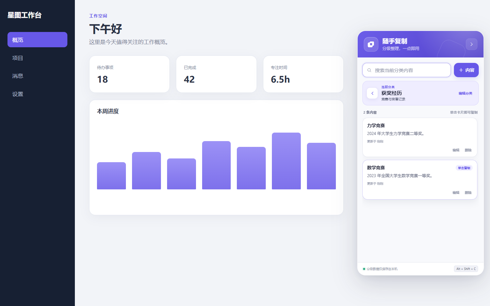

# 随手复制

一个本地优先的 Chrome / Edge 浏览器扩展。它在网页右侧提供可收起的悬浮面板，使用“一级分类 → 二级文字内容”整理常用信息；进入分类后，单击文字卡片即可复制完整正文。

| 一级分类首页 | 二级内容详情 |
| --- | --- |
|  |  |

## 功能

- 一级首页只展示分类，点击分类后进入二级内容
- 分类显示名称、说明、内容数量和二级标题预览
- 在分类内新增、编辑、删除可复制文字卡片
- 单击二级卡片复制完整文本，保留换行与首尾空格
- 首页搜索会同时匹配分类名称、说明及其二级正文
- 分类内搜索只筛选当前分类的文字内容
- 删除非空分类前二次确认，并明确提示关联内容数量
- 从 1.0 升级时，原有平铺内容自动归入“未分类”
- 一键收起或展开，并记住上次状态
- 数据通过 `chrome.storage.local` 保存在本机
- 浏览器工具栏按钮与 `Alt + Shift + C` 快捷键切换面板
- Shadow DOM 样式隔离、深色模式和窄屏适配

## 本地安装

### Chrome

1. 打开 `chrome://extensions/`。
2. 开启右上角的“开发者模式”。
3. 点击“加载已解压的扩展程序”。
4. 选择本项目根目录（即包含 `manifest.json` 的文件夹）。

### Edge

1. 打开 `edge://extensions/`。
2. 开启“开发人员模式”。
3. 点击“加载解压缩的扩展”。
4. 选择本项目根目录。

安装后打开任意普通网页即可看到右侧面板。浏览器内部页面（例如 `chrome://`、`edge://` 和扩展商店）出于浏览器安全规则不能注入面板。

## 使用方式

1. 在首页点击“分类”，填写一级分类名称及可选说明。
2. 保存后自动进入该分类，再点击“内容”添加二级文字。
3. 单击二级卡片主体复制完整正文；编辑、删除按钮不会触发复制。
4. 点击左上角返回箭头回到全部分类。
5. 点击面板右上角箭头收起；点击右侧紫色标签再次展开。

## 升级说明

数据模型从 1.0 的平铺列表升级为 1.1 的两级结构。扩展首次读取旧数据时会自动建立“未分类”，并把所有旧文字卡片迁入其中；正文格式、创建时间和更新时间都会保留。

## 隐私与权限

- `storage`：仅用于在浏览器本地保存分类、文字卡片和收起状态。
- 网页访问范围：用于在普通网页中注入右侧悬浮面板。
- 扩展不包含分析代码、远程接口或网络上传逻辑。

请勿保存密码、私钥、验证码等高敏感信息。浏览器本地存储不是密码保险箱。

## 开发与验证

项目没有运行时依赖，只需 Node.js 18 或更高版本：

```powershell
npm run check
npm test
```

`npm run check` 会校验 Manifest 引用和 JavaScript 语法。`npm test` 包含 7 项模型测试，覆盖旧数据迁移、层级关系、跨层搜索、内容格式保留和编辑逻辑；此外项目已通过真实 Edge 端到端层级流程验证。

## 目录结构

```text
quick-copy-panel/
├─ manifest.json
├─ src/
│  ├─ background.js      # 工具栏按钮与快捷键
│  ├─ content.js         # 两级导航、存储、编辑和复制行为
│  ├─ model.js           # 层级数据、迁移和搜索逻辑
│  └─ panel.css          # Shadow DOM 内的完整界面样式
├─ scripts/
│  └─ validate-extension.js
├─ test/
│  └─ model.test.js
└─ docs/
   ├─ DESIGN.md
   ├─ preview.png
   └─ preview-detail.png
```

产品需求、信息架构和验收标准见 [设计说明](docs/DESIGN.md)。

## License

[MIT](LICENSE)
