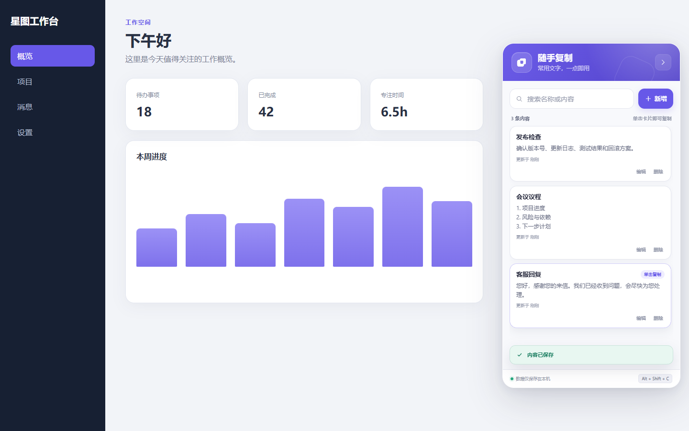

# 随手复制

一个本地优先的 Chrome / Edge 浏览器扩展。它在网页右侧提供可收起的悬浮面板，用“名称 / 主题”管理常用文本，单击文字卡片即可复制完整内容。



## 功能

- 右侧悬浮，不改变网页原有布局
- 一键收起或展开，并记住上次状态
- 新增、编辑、删除“名称 / 主题 + 文本内容”
- 单击卡片复制完整文本，保留换行与首尾空格
- 同时搜索名称和正文，支持多个关键词
- 数据通过 `chrome.storage.local` 保存在本机
- 浏览器工具栏按钮与 `Alt + Shift + C` 快捷键切换面板
- Shadow DOM 样式隔离、深色模式和窄屏适配

## 本地安装

### Chrome

1. 打开 `chrome://extensions/`。
2. 开启右上角的“开发者模式”。
3. 点击“加载已解压的扩展程序”。
4. 选择本项目根目录（即包含 `manifest.json` 的文件夹）。

### Edge

1. 打开 `edge://extensions/`。
2. 开启“开发人员模式”。
3. 点击“加载解压缩的扩展”。
4. 选择本项目根目录。

安装后打开任意普通网页即可看到右侧面板。浏览器内部页面（例如 `chrome://`、`edge://` 和扩展商店）出于浏览器安全规则不能注入面板。

## 使用方式

1. 点击“新增”，填写名称 / 主题和要保存的文本。
2. 单击保存后的卡片主体，完整正文会进入剪贴板。
3. 使用卡片底部按钮编辑或删除，不会误触复制。
4. 点击面板右上角箭头收起；点击右侧紫色标签再次展开。

## 隐私与权限

- `storage`：仅用于在浏览器本地保存文字卡片和收起状态。
- 网页访问范围：用于在普通网页中注入右侧悬浮面板。
- 扩展不包含分析代码、远程接口或网络上传逻辑。

请勿保存密码、私钥、验证码等高敏感信息。浏览器本地存储不是密码保险箱。

## 开发与验证

项目没有运行时依赖，只需 Node.js 18 或更高版本：

```powershell
npm run check
npm test
```

`npm run check` 会校验 Manifest 引用和 JavaScript 语法，`npm test` 会验证数据清洗、搜索、排序和编辑逻辑。

## 目录结构

```text
quick-copy-panel/
├─ manifest.json
├─ src/
│  ├─ background.js      # 工具栏按钮与快捷键
│  ├─ content.js         # 面板交互、存储和复制行为
│  ├─ model.js           # 可测试的纯数据逻辑
│  └─ panel.css          # Shadow DOM 内的完整界面样式
├─ scripts/
│  └─ validate-extension.js
├─ test/
│  └─ model.test.js
└─ docs/
   └─ DESIGN.md
```

产品需求、交互决策和验收标准见 [设计说明](docs/DESIGN.md)。

## License

[MIT](LICENSE)
